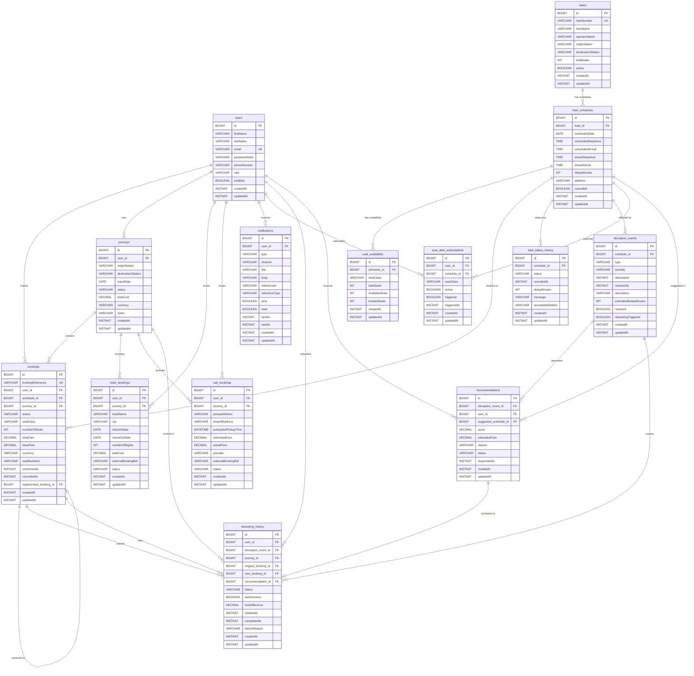

# Phase 2 — Database Entity Layer

**Project:** AI-Powered Autonomous Train Disruption Concierge & Smart Seat Alert System  
**Phase:** 2 of N  
**Status:** ✅ Complete  
**Completed On:** October 2026

---

## What Phase 2 Covers

Phase 2 implements the complete JPA entity model — every table, relationship, enum,
and repository the system will ever need. No services or controllers are built yet.
This phase is the data contract everything else is built on top of.

---

## Objectives Achieved

| # | Objective | Status |
|---|---|---|
| 1 | All 13 domain entities created | ✅ |
| 2 | All 8 enums defined | ✅ |
| 3 | All 13 repositories with finder methods | ✅ |
| 4 | Proper foreign keys and cardinalities | ✅ |
| 5 | BigDecimal for all monetary fields | ✅ |
| 6 | LocalDate / LocalDateTime / Instant used appropriately | ✅ |
| 7 | Unique constraints on business identifiers | ✅ |
| 8 | createdAt / updatedAt on all entities via BaseEntity | ✅ |
| 9 | All relationships use LAZY fetch | ✅ |
| 10 | No bidirectional collections — zero circular serialisation risk | ✅ |
| 11 | Rebooking preserves original booking history | ✅ |
| 12 | H2 added to test scope — no MySQL needed for tests | ✅ |
| 13 | Hibernate creates all 13 tables — test verified | ✅ |

---

## Files Created

### Enums (8)

| File | Package | Values |
|---|---|---|
| `UserRole.java` | `user` | `ROLE_USER`, `ROLE_ADMIN` |
| `TrainStatus.java` | `train` | `ON_TIME`, `DELAYED`, `CANCELLED`, `DIVERTED`, `ARRIVED`, `DEPARTED`, `UNKNOWN` |
| `BookingStatus.java` | `booking` | `PENDING`, `CONFIRMED`, `CANCELLED`, `REFUNDED`, `COMPLETED`, `REBOOKED` |
| `JourneyStatus.java` | `journey` | `PLANNED`, `IN_PROGRESS`, `DISRUPTED`, `COMPLETED`, `CANCELLED`, `REBOOKED` |
| `DisruptionType.java` | `disruption` | `DELAY`, `CANCELLATION`, `DIVERSION`, `PARTIAL_CANCELLATION`, `PLATFORM_CHANGE`, `SPEED_RESTRICTION`, `ENGINEERING_WORKS`, `WEATHER`, `INCIDENT`, `UNKNOWN` |
| `DisruptionSeverity.java` | `disruption` | `LOW`, `MEDIUM`, `HIGH`, `CRITICAL` |
| `RebookingStatus.java` | `rebooking` | `PENDING`, `AWAITING_CONSENT`, `IN_PROGRESS`, `COMPLETED`, `DECLINED`, `FAILED`, `EXPIRED` |
| `NotificationType.java` | `notification` | `DISRUPTION_ALERT`, `REBOOKING_SUGGESTION`, `REBOOKING_CONFIRMED`, `SEAT_AVAILABLE`, `BOOKING_CONFIRMED`, `BOOKING_CANCELLED`, `JOURNEY_REMINDER`, `GENERAL` |
| `NotificationChannel.java` | `notification` | `PUSH`, `EMAIL`, `SMS`, `IN_APP` |
| `SeatClass.java` | `seat` | `FIRST`, `SECOND`, `SLEEPER`, `BUSINESS` |

### Entities (13)

| Entity | Table | Key Fields |
|---|---|---|
| `User` | `users` | email (unique), passwordHash, role, enabled |
| `Train` | `trains` | trainNumber (unique), operatorName, origin, destination |
| `TrainSchedule` | `train_schedules` | train+date (unique), scheduled/actual times, delayMinutes |
| `SeatAvailability` | `seat_availability` | schedule+seatClass (unique), available/booked counts |
| `Booking` | `bookings` | bookingReference (unique), totalFare (BigDecimal), status |
| `Journey` | `journeys` | user, origin, destination, travelDate, status |
| `HotelBooking` | `hotel_bookings` | user, journey, checkIn/Out dates, totalCost (BigDecimal) |
| `CabBooking` | `cab_bookings` | user, journey, pickup/dropoff, estimatedFare (BigDecimal) |
| `TrainStatusHistory` | `train_status_history` | schedule, status, recordedAt (Instant), delayMinutes |
| `DisruptionEvent` | `disruption_events` | schedule, type, severity, detectedAt, resolved |
| `Recommendation` | `recommendations` | disruptionEvent, user, suggestedSchedule, score (BigDecimal), status |
| `RebookingHistory` | `rebooking_history` | originalBooking, newBooking, disruptionEvent, status, fareDifference |
| `Notification` | `notifications` | user, type, channel, title, body, sent, read |
| `SeatAlertSubscription` | `seat_alert_subscriptions` | user+schedule+seatClass (unique), active, triggered |

### Repositories (13)

| Repository | Key Finders |
|---|---|
| `UserRepository` | `findByEmail`, `existsByEmail` |
| `TrainRepository` | `findByTrainNumber`, `findByOriginAndDestination`, `findByActiveTrue` |
| `TrainScheduleRepository` | `findAvailableSchedules` (JPQL), `findByTrainAndScheduledDateBetween` |
| `SeatAvailabilityRepository` | `findByScheduleAndSeatClass`, `findByScheduleAndAvailableSeatsGreaterThan` |
| `BookingRepository` | `findByBookingReference`, `findByUserAndStatus`, `findByScheduleAndStatus` |
| `JourneyRepository` | `findByUserAndStatus`, `findByUserAndTravelDateBetween` |
| `HotelBookingRepository` | `findByUser`, `findByJourney`, `findByUserAndStatus` |
| `CabBookingRepository` | `findByUser`, `findByJourney`, `findByUserAndStatus` |
| `TrainStatusHistoryRepository` | `findByScheduleOrderByRecordedAtDesc`, `findByScheduleAndStatus` |
| `DisruptionEventRepository` | `findByResolvedFalse`, `findByScheduleAndResolvedFalse`, `findBySeverity` |
| `RecommendationRepository` | `findByDisruptionEventOrderByScoreDesc`, `findByUserAndStatus` |
| `RebookingHistoryRepository` | `findByOriginalBooking`, `findByDisruptionEvent`, `findByUserAndStatus` |
| `NotificationRepository` | `findByUserAndReadFalse`, `findBySentFalse` |
| `SeatAlertSubscriptionRepository` | `findByScheduleAndSeatClassAndActiveTrueAndTriggeredFalse` |

---

## Entity Relationships Explained

### User
Central entity. Every booking, journey, notification, and subscription is owned by a user.
One User has many Bookings, Journeys, Notifications, SeatAlertSubscriptions, and RebookingHistory records.
Collections are **not** mapped on the User side — traverse via repositories to avoid N+1 and circular serialisation.

### Train → TrainSchedule
A Train (e.g. "12301 Rajdhani") is a physical/operational entity with a unique train number.
Each day it runs is one `TrainSchedule` row. A schedule carries the real-time departure/arrival
and delay information. Unique constraint on `(train_id, scheduledDate)` prevents duplicate schedules.

### TrainSchedule → SeatAvailability
One row per `(schedule, seatClass)`. As bookings are made or cancelled, `availableSeats`
and `bookedSeats` are updated. The seat alert engine watches this table.

### User + TrainSchedule → Booking
A Booking is the actual ticket purchase. It links a User to a TrainSchedule on a specific date.
`bookingReference` is a unique human-readable code. `totalFare` and `baseFare` use `BigDecimal`
with `precision=10, scale=2` to prevent floating-point errors on money.

When a booking is disrupted and rebooked, its status becomes `REBOOKED` and
`replacementBooking` points to the new booking — the original record is preserved forever.

### Booking → Journey
A Journey groups multiple Bookings into one logical trip (multi-leg travel).
Single-leg bookings may exist without a Journey. The `journey_id` FK is nullable on Booking.

### TrainSchedule → DisruptionEvent
One disruption event per affected schedule. A real signal failure may create multiple
`DisruptionEvent` rows — one per each schedule it hits. Severity drives notification urgency
and rebooking trigger logic.

### DisruptionEvent + User → Recommendation
The AI engine generates `Recommendation` rows after a disruption, one per (disruption, affected user).
Multiple recommendations may be generated, ranked by `score`. The passenger picks one → triggers rebooking.

### Recommendation → RebookingHistory
`RebookingHistory` is the permanent audit log. It links:
- The **original booking** (never deleted)
- The **new booking** (created on completion)
- The **disruption** that caused it
- The **recommendation** that was accepted (null for manual rebookings)
- The **fare difference** (new − original, negative = refund)
- The **status** lifecycle from `PENDING` → `COMPLETED` / `DECLINED` / `FAILED`

This design means you can always reconstruct the full disruption recovery chain for any journey.

### TrainSchedule → TrainStatusHistory
Append-only log of every status change on a schedule. Never updated or deleted.
Used for analytics, delay pattern analysis, and AI model training.

### User → Notification
Generic outbox/inbox. `referenceId` + `referenceType` provide a loosely-typed link
to the entity that triggered the notification (booking, disruption, recommendation)
without coupling this table to every other table with hard FKs.

### User + TrainSchedule → SeatAlertSubscription
Unique per `(user, schedule, seatClass)`. When `SeatAvailability.availableSeats > 0`
for the watched combination, the alert engine fires and marks `triggered = true`.

---

## Database Relationship Diagram



---

## Design Decisions

### No bidirectional collections
No `@OneToMany` collections are mapped on the "one" side (e.g. no `List<Booking>` on `User`).
This deliberately avoids:
- Accidental eager loading of thousands of records
- `StackOverflowError` from circular `toString()` / JSON serialisation
- N+1 queries from Hibernate walking collections

All collections are accessed through repositories only.

### Instant vs LocalDateTime vs LocalDate
- `Instant` — absolute UTC timestamps (createdAt, detectedAt, sentAt). Safe across time zones.
- `LocalDateTime` — user-facing scheduled times where timezone is the train's operating region.
- `LocalDate` — calendar dates (travel date, check-in, check-out) with no time component.
- `LocalTime` — departure and arrival times on a schedule (no date, no timezone).

### BigDecimal for money
All fare, cost, and fare-difference fields use `BigDecimal(precision=10, scale=2)`.
This is the only correct type for money in Java. `double` and `float` are prohibited.

### RebookingHistory preserves originals
Original `Booking` rows are **never deleted**. When disrupted, `Booking.status` becomes `REBOOKED`
and `replacementBooking` FK points to the new booking. `RebookingHistory` stores the full audit chain.
This supports passenger dispute resolution, refund auditing, and ML training data.

### Notification is generic
`referenceId` + `referenceType` store a loosely-typed reference to the triggering entity
(e.g. `referenceType = "BOOKING"`, `referenceId = "TC-20261001-0001"`).
This avoids 8 separate FK columns for every possible source and keeps the table clean.

### SeatAlertSubscription unique constraint
`(user_id, schedule_id, seatClass)` prevents duplicate subscriptions.
The service layer can use `findOrCreate` semantics safely.

### TrainStatusHistory is append-only
Rows are never updated or deleted. This gives a complete temporal record of every
status transition for analytics, SLA reporting, and model training.

---

## How to Run Phase 2

Phase 2 adds entities and repositories — no new endpoints. The run steps are
identical to Phase 1 but Hibernate will now create **13 tables** in MySQL on first
startup.

### Step 1 — Set environment variables

```powershell
$env:DB_HOST     = "localhost"
$env:DB_PORT     = "3306"
$env:DB_NAME     = "train_concierge"
$env:DB_USERNAME = "root"
$env:DB_PASSWORD = "your_mysql_password_here"
$env:DDL_AUTO    = "update"
```

### Step 2 — Build

```powershell
mvn clean install -DskipTests "-Djavax.net.ssl.trustStoreType=Windows-ROOT"
```

### Step 3 — Run

```powershell
mvn spring-boot:run "-Djavax.net.ssl.trustStoreType=Windows-ROOT"
```

Watch for Hibernate's table creation in the console:
```
create table users (...)
create table trains (...)
create table train_schedules (...)
...
HikariPool-1 - Start completed.
Started TrainConciergeApplication in X.XXX seconds
```

### Step 4 — Run tests (H2 — no MySQL required)

```powershell
mvn test "-Djavax.net.ssl.trustStoreType=Windows-ROOT"
```

Expected:
```
Tests run: 1, Failures: 0, Errors: 0, Skipped: 0
BUILD SUCCESS
```

### Step 5 — Verify all 13 tables were created in MySQL

```powershell
mysql -u root -p -e "USE train_concierge; SHOW TABLES;"
```

Expected output — all 13 tables:
```
+------------------------------+
| Tables_in_train_concierge    |
+------------------------------+
| bookings                     |
| cab_bookings                 |
| disruption_events            |
| hotel_bookings               |
| journeys                     |
| notifications                |
| rebooking_history            |
| recommendations              |
| seat_alert_subscriptions     |
| seat_availability            |
| train_schedules              |
| train_status_history         |
| trains                       |
| users                        |
+------------------------------+
```

---

## Hibernate Schema Verification

Tests run against H2 in-memory database with `ddl-auto=create-drop`.
Hibernate generated all 13 tables successfully:

```
✅ users
✅ trains
✅ train_schedules
✅ seat_availability
✅ bookings
✅ journeys
✅ hotel_bookings
✅ cab_bookings
✅ train_status_history
✅ disruption_events
✅ recommendations
✅ rebooking_history
✅ notifications
✅ seat_alert_subscriptions
```

**Test result: 1 test passed, 0 failures, 0 errors.**

To verify schema creation against your local MySQL, run:

```powershell
$env:DB_HOST="localhost"
$env:DB_PORT="3306"
$env:DB_NAME="train_concierge"
$env:DB_USERNAME="root"
$env:DB_PASSWORD="your_password"
mvn spring-boot:run "-Djavax.net.ssl.trustStoreType=Windows-ROOT"
```

Then check MySQL Workbench or run:
```sql
USE train_concierge;
SHOW TABLES;
```

---

## Known Limitations

| Limitation | Planned Resolution |
|---|---|
| No User authentication | Phase 3 — Spring Security + JWT |
| No DTOs — entities only | Phase 3 — MapStruct DTOs per module |
| HotelBooking / CabBooking status is a plain String | Phase 4 — add dedicated enums |
| No soft-delete support | Phase 5 — add `deletedAt` to BaseEntity |
| No Flyway migrations | Phase 6 — replace `ddl-auto=update` |
| No Testcontainers (real MySQL in CI) | Phase 4 — add Testcontainers test profile |
| `seatNumbers` stored as comma-separated string | Phase 4 — normalise to a seat allocation table |

---

## What's Next — Phase 3

Phase 3 will implement **Authentication & Security**:

- `Spring Security` configuration
- `JWT` token generation and validation
- `POST /api/v1/auth/register`
- `POST /api/v1/auth/login`
- `POST /api/v1/auth/refresh`
- `UserDetailsService` backed by `UserRepository`
- BCrypt password hashing wired into `User` entity
- Role-based access control (`ROLE_USER`, `ROLE_ADMIN`)
- DTOs and MapStruct mappers for `User`
- Request/response logging filter

---

## Roadmap Overview

| Phase | Focus Area | Status |
|---|---|---|
| 1 | Foundation & Infrastructure | ✅ Complete |
| **2** | **Database Entity Layer** | ✅ **Complete** |
| 3 | Authentication & Security | 🔲 Planned |
| 4 | Train, Schedule & Seat APIs | 🔲 Planned |
| 5 | Booking & Journey APIs | 🔲 Planned |
| 6 | Disruption Detection Engine | 🔲 Planned |
| 7 | AI Recommendation Engine | 🔲 Planned |
| 8 | Autonomous Rebooking | 🔲 Planned |
| 9 | Hotel & Cab Integration | 🔲 Planned |
| 10 | Notifications & Simulation | 🔲 Planned |

---

*Phase 2 complete — full entity model is stable, tested, and ready for service layer development.*
